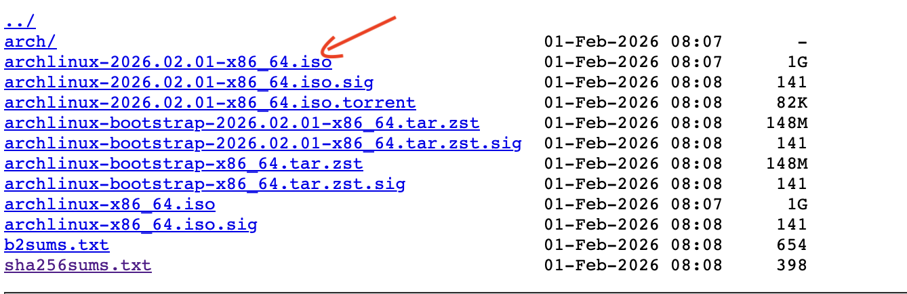

# Instalar Arch Linux

Esta es una guía sobre cómo instalar Arch Linux sin utilizar el comando `archinstall`.

## 1. Pre instalación

### 1.1 Descarga de la imagen

1.  Visita [archlinux.org/download](https://archlinux.org/download/) y selecciona un servidor espejo cercano a tu ubicación.
2.  Una vez elegido el país, se mostrará una lista con varios enlaces disponibles. El archivo ISO suele aparecer como el tercer enlace de la lista: .

### 1.2 Validar firma

Abre el archivo sha256sums.txt (último enlace de la lista) y verifica que la firma SHA256 coincida con la del archivo ISO que descargaste.

### 1.3 Crear USB booteable

1. Se recomienda usar [Rufus](https://rufus.ie/en/) para crear el USB booteable.
2. Reinicie el equipo y entra a la BIOS.
3. Configura el USB como primera opción de arranque.

### 1.4 Arrancar desde la USB

1. Guarda los cambios en la BIOS.
2. Reinicia el equipo.

### 1.5 Verificar el boot mode

Para comprobar el modo de arranque, ejecuta el siguiente comando:

`cat /sys/firmware/efi/fw_platform_size`

Según el resultado, el modo de arranque será:

| Resultado del comando     | Modo de arranque        |
| ------------------------- | ----------------------- |
| 64                        | UEFI 64 bits            |
| 32                        | UEFI 32 bits (limitado) |
| No such file or directory | BIOS / CSM              |

### 1.6 Conectarse a Internet

Para comprobar si tienes acceso a internet, ejecuta el siguiente comando:

`ping google.com`

Si no estas conectado por cable Ethernet sigue las instrucciones para conectarte por Wi-Fi en el siguiente enlace:

[iwtcl](https://wiki.archlinux.org/title/Iwd#iwctl)

### 1.7 Validar reloj del sistema

Para comprobar que el reloj del sistema está sincronizado, ejecuta el siguiente comando:

`timedatectl`

### 1.8 Particionar el disco

1. Verifica qué discos tienes conectados ejecutando: `lsblk`.
2. Usa `cfdisk` para particionar el disco. Sigue estos pasos:
   1. Ejecuta: `cfdisk /dev/[Nombre-del-disco]`
   2. Si el disco ya tiene particiones, las eliminamos. En el menú inferior selecciona `Delete`. Repite el proceso hasta que el disco quede sin particiones.
   3. Selecciona `New` para crear una nueva partición.
   4. Cuando pregunte el tamaño, escribe `1G` (Esta sera la partición EFI)
   5. Con las flechas del teclado, selecciona la opción `Type` en el menu inferior.
   6. En la lista que aparece, elige `EFI System`
   7. Selecciona el espacio restante (`Free Space`) y pulsa `New`
   8. Asigna el resto del espacio del disco para esta partición (Esta es la raíz)
   9. Verifica que el tipo (`Type`) sea `Linux filesystem`
   10. En el menú inferior, selecciona `Write` y escribe `yes` para guardar los cambios.
   11. Finalmente, selecciona `Quit` para salir.
3. Imagen de ejemplo: 
4. Para comprobar que las particiones se crearon correctamente, ejecuta nuevamente `lsblk`

### 1.9 Formatear las particiones

Una vez creadas las particiones, debes formatearlas.

El comando general es `mkfs.[file-system] /dev/[partition]`

- `[file-system]` es el sistema de archivos a utilizar.
- `[partition]` es la partición que vas a formatear.

Sistema de archivos recomendados:

| file-system | partition | type             |
| ----------- | --------- | ---------------- |
| ext4        | /         | Linux filesystem |
| fat -F 32   | /boot     | EFI System       |

Ejemplos:

- `mkfs.ext4 /dev/root_partition`
- `mkfs.fat -F 32 /dev/efi_system_partition`

Si el sistema te pide confirmación, escribe `y` y presiona Enter.

### 1.10 Montar los discos

Ahora debes montar las particiones que usara el sistema.

1. Monta la partición raíz con el siguiente comando:

   `mount /dev/[root-partition] /mnt`

2. Monta la partición EFI con el siguiente comando:

   `mount --mkdir /dev/[efi-partition] /mnt/boot`

3. Si creaste particiones adicionales, monta las particiones con:

   `mount --mkdir /dev/[additional-partition] /mnt/[additional-partition]`

4. Para verificar que las particiones se montaron correctamente, ejecuta:

   `lsblk`

   En la columna MOUNTPOINTS podrás ver dónde está montada cada partición.

## 2. Instalación

### 2.1 Instalar paquetes esenciales

Para instalar los paquetes básicos del sistema, ejecuta el siguiente comando:

`pacstrap -K /mnt base linux linux-firmware`

Este comando instalará el sistema base, el kernel de Linux y el firmware necesario.

## 3 Configuración del sistema

### 3.1 Fstab

1. Genera el archivo fstab con el siguiente comando:

`genfstab -U /mnt >> /mnt/etc/fstab`

2. Verifica que el archivo se haya creado correctamente:

`cat /mnt/etc/fstab`

Al ejecutar el comando, deberías ver las particiones que montaste anteriormente.

### 3.2 chroot

Accedemos al entorno del nuevo sistema cambiando la raíz con el siguiente comando:

`arch-chroot /mnt`

### 3.3 Instalar herramientas básicas

Instale nano con el siguiente comando para poder editar archivos:

`pacman -S nano`

Instale networkmanager para habilitar la conexión a internet:

`pacman -S networkmanager`

Inicie y habilite el servicio con el siguiente comando:

`systemctl enable NetworkManager`

Instale el microcódigo correspondiente a su procesador:

- Para procesadores AMD:
  `pacman -S amd-ucode`
- Para procesadores Intel:
  `pacman -S intel-ucode`

### 3.4 Zona horaria

Para ver el listado de zonas horarias disponibles, ejecute:

`timedatectl list-timezones`

Defina su zona horaria con el siguiente comando:

`timedatectl set-timezone Area/Location`

Luego cree el enlace simbólico correspondiente:

`ln -sf /usr/share/zoneinfo/Area/Location /etc/localtime`

Ejemplo:

`timedatectl set-timezone America/Bogota`

`ln -sf /usr/share/zoneinfo/America/Bogota /etc/localtime`

Finalmente, genere el archivo /etc/adjtime con el comando:

`hwclock --systohc`

### 3.5 Idioma del sistema

Edite el archivo de configuración de idiomas con el siguiente comando:

`nano /etc/locale.gen`

Descomente los siguientes idiomas que desee utilizar eliminando el símbolo `#` al inicio de cada linea.

Ejemplo:

`en_US.UTF8 UTF-8`

Para guardar el archivo en nano, presione `ctrl + o`, luego Enter para mantener el mismo nombre, y para salir presione `ctrl + x`

Después, ejecute el siguiente comando para generar los idiomas:

`locale-gen`

Ahora cree el archivo locale.conf con el siguiente comando:

`echo "LANG=en_US.UTF-8" >> /etc/locale.conf`

Si desea usar español u otro idioma, cambie `en_US.UTF-8` por el que haya descomentado anteriormente.

Para verificar que la configuración es correcta, ejecute:

`cat /etc/locale.conf`

Si desea ver las distribuciones de teclado disponibles, utilice:

`localectl list-keymaps`

Cree el archivo vconsole.conf con uno de los siguientes comandos:

- Para teclado en español:
  `echo "KEYMAP=es" >> /etc/vconsole.conf`
- Para teclado en ingles con acentos:
  `echo "KEYMAP=us-acentos" >> /etc/vconsole.conf`

Para validar la configuración ejecute:

`cat /etc/vconsole.conf`

### 3.6 Configurar la red

Asigne el nombre de su equipo con el siguiente comando:

`echo "[yourhostname]" >> /etc/hostname`

Remplace el [yourhostname] por el nombre que desea asignar.

Para verificar que se configuró correctamente, ejecute:

`cat /etc/hostname`

### 3.7 Contraseña root

Establezca una contraseña para el usuario root ejecutando el siguiente comando:

`passwd`

### 3.8 Gestor de arranque

Instale GRUB como gestor de arranque con los siguientes comandos:

`pacman -S grub`

`pacman -S efibootmgr`

Instale GRUB en el sistema UEFI ejecutando:

`grub-install --target=x86_64-efi --efi-directory=/boot --bootloader-id=GRUB --removable`

Finalmente, genere el archivo de configuración con:

`grub-mkconfig -o /boot/grub/grub.cfg`

## 4 Reiniciar

Salga del entorno actual con el comando:

`exit`

Desmonte las unidades montadas con:

`umount -R /mnt`

Finalmente, reinicie el sistema con:

`reboot`

O apague el equipo con:

`poweroff`

## 5 Pos instalación

Vea el articulo de [documentación](./README.md) para obtener instrucciones de como gestionar el sistema, asi como tutoriales de qué hacer después de la instalación.

## Documentación

En caso de necesitarlo se puede volver a consultar la documentación oficial de Arch Linux: [Documentación](https://wiki.archlinux.org/title/Installation_guide)
